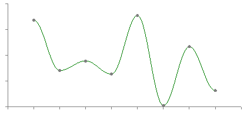

# Cannon Tutorial
By OneShotMC 

## Contributors 
- Andrew Gazelka — [GitHub](https://github.com/andrewgazelka)

## Forewarning
This tutorial is a work in progress. Although it aims to describe low level properties of TNT, it is currently far from complete. Additionally, the [emergent properties](https://en.wikipedia.org/wiki/Emergence) of TNT introduce many elements for cannoning which can not be seen from a low-level overview of TNT. Thus, do not expect to be well-versed with all applications of TNT but rather expect to be knowledgeable of the inner workings of TNT.
## The basics of TNT
When Primed TNT is spawned from a dispenser, from redstone, or from flint and steel, it will become an entity which will explode 80 **gameticks** later.

### What is a gametick?
In Minecraft (and most games), time is not **continuous**—or always updating. Instead, it is **discrete**—and updates at certain, defined intervals. 

Imagine you have a 60 Hz monitor. What you are seeing is not continuous (the screen isn't different at 34.53 frames as 34 frames). Minecraft, is the same way. However, instead of calculations occuring each frame, they occur each **gametick**. No matter what your FPS is, a gametick will occurs every 50 ms (or 20 times a second). Since gameticks are discrete, if an entity is at location `(0,0,0)` one gametick and `(0,0,100)` the next gametick, it was never exists at `(0,0,50)`. It is important to realize that there are still calculations for TNT to make sure it will stop early if there is a wall, perhaps at `(0,0,50)`, but the TNT itself never exists at this location. Each gametick—among other things—TNT will look at its current velocity, possible areas for collision, and teleport to the resultant location.

You might wonder why entities appear at more than *20 FPS* when viewed from your client. This is because Minecraft uses **interpolation**. This means that although the client is sent data at `20 Hz`, it will have a smooth animation between these points to make it more visually appealing. This animation is only for visuals... the TNT is never actually at this location.

Using our example where the TNT moves from `(0,0,0)` to `(0,0,100)`, all that is sent to the client in that gametick (in regards to the TNT entity) is `EntityPlayoutPacket({entity id}, (0,0,100))`. which  are sent to the client and the client will create a smooth transition between them lasting for 50 ms, even though this is not how TNT actually behaves.

#### An example of interpolation between points


### What is a redstone tick?
Although it is possible to operate with single gametick offsets, it is fairly difficult. We will cover this later, but for now, we will focus primarily on redstone ticks, which normally serve as the base time unit when building cannons. 

Each redstone tick is equivalent to `2 gameticks`. Each time you right click a redstone repeater, you are adding a redstone ticks up until you get to 4 redstone ticks (or 8 gameticks). 

This means that you will need 10 full redstone repeaters to reach 80 gameticks (how long it takes TNT to explode).

### Exploding
When TNT explodes, it does the following in order:

1) finds `{blocks}` to explode
2) finds nearby `{entities}` and applies `{velocity}` + `{damage}` (does not factor in the just-destroyed `{blocks}` into calculations)
3) destroys `{blocks}`

### Liquids
If more than half of TNT is in water or lava, it will not do any block damage. Note TNT has a width and height of `.98 blocks`. This means that if TNT is on top of a watered slab, it will still do block damange. Since TNT applies velocity to other entities, this means we can use an explosion of one TNT to push another TNT. This is the foundation of cannoning.

### Applying Velocity

#### Patched TNT Physics
Psuedocode (based on Kotlin cause Kotlin is cool)

```kotlin

fun tntExplode(tnt: TNT){
    val distanceToCenter = .98 / 2
    doExplode(tnt.location + Point(0, distanceToCenter, 0))
}

fun doExplosion(explosionLocation: Point){
    // process blocks
    processEntitiesFor(explosionLocation)
    // remove blocks
}

fun processEntitiesFor(explosionLocation: Point){
    val from = (explosionLocation - Point(9, 9, 9)).floor()
    val to = (explosionLocation + Point(9, 9, 9)).floor()
    val distanceToCenterPatched = .98 / 2
    for(entity in entitiesIn(from..to)){
        val dx = entity.location - explosionLocation
        val dy = (entity.location + distanceToCenter) - explosionLocation
        val dz = entity.location - explosionLocation

        val difference = Point(dx,dy,dz)
        val distance = distance.mag()
        if(distance != 0 && distance < 8.0){
            // do calculations (i.e., look at blocks in the way) and apply velocity
        }
    }
}

```
What this basically means is TNT will apply velocity to other entities with a max distance of `8.0` blocks away (not counting obstructions)

#### Unpatched TNT Physics
On 1.8 and *several later versions* TNT will by default be extremely broken. This is because there is a bug where `distanceToCenterPatched` is not added for the `dy` calculations. This causes large problems: if TNT `a` has the same exact coordinates as TNT `b`, TNT `a` will still apply a net  y velocity to TNT `b`. 